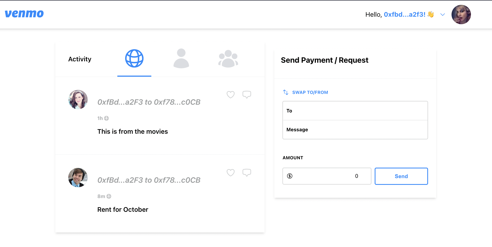

# Venmo Clone 👋

Based on youtube tutorial [Build Venmo Web3 Clone with Next.js & Solidity](https://www.youtube.com/watch?v=rQadaQXSO08)

  
  
     Venmo
      
  
  
  
   
     
    <a href="https://github.com/brenfondeadora/venmo-blockchain-youtube/issues/new">Report bug</a>
    ·
    <a href="https://github.com/brenfondeadora/venmo-blockchain-youtube/issues/new">Request feature</a>

    
  
  

## 🤖 Requirements

- Have an account on [netlify](https://www.netlify.com/) to upload the project

- Run netlify dev

## ✨ TODO

- [ ] Tests

 

## 👤 Author

**Brenda Saavedra**

- WebPage: [brendasaavedra.com](http://brendasaavedra.com)
- Github: [@brenfondeadora](https://github.com/brenfondeadora/)

 

## 📝 License

Copyright © 2022 [Brenda Saavedra](https://github.com/brenfondeadora). 
This project is [MIT License](LICENSE)
